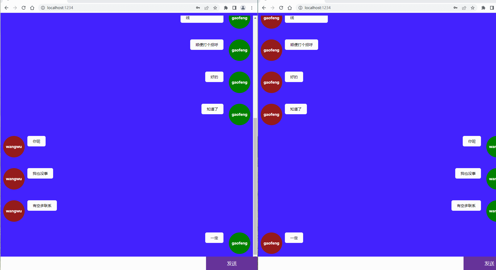
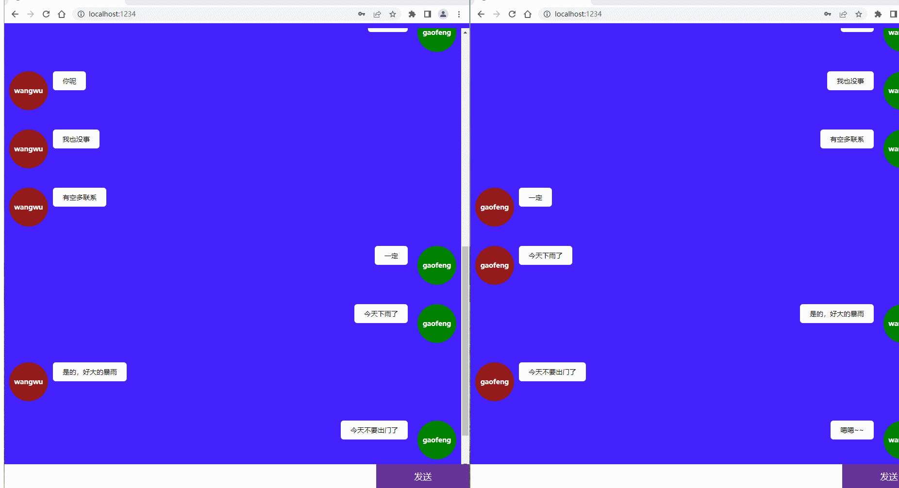
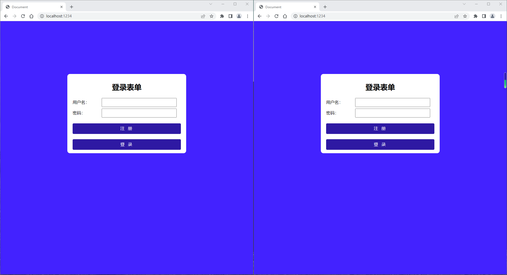
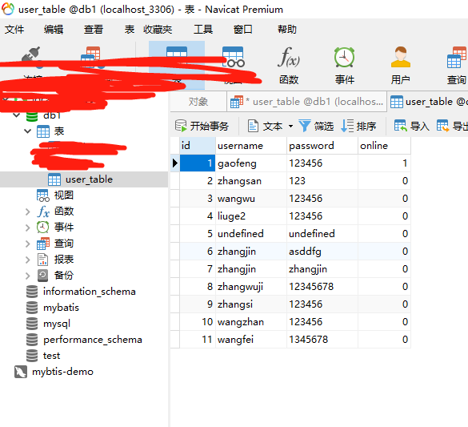
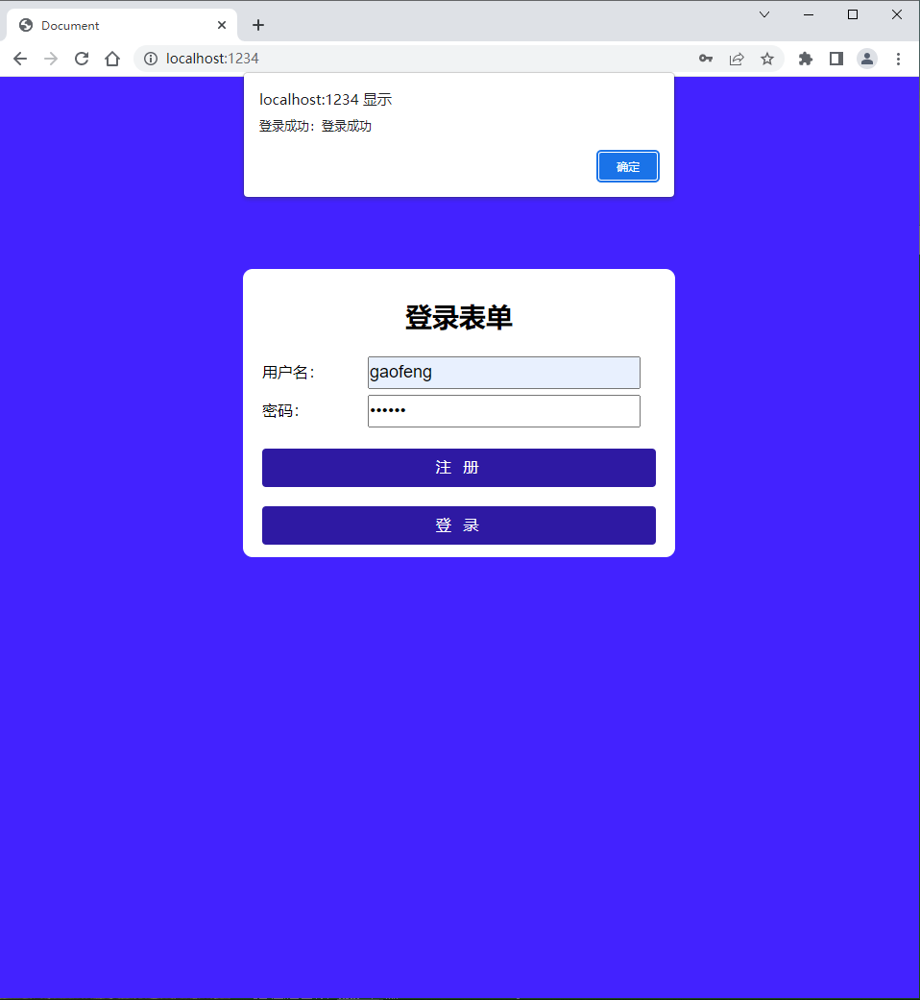
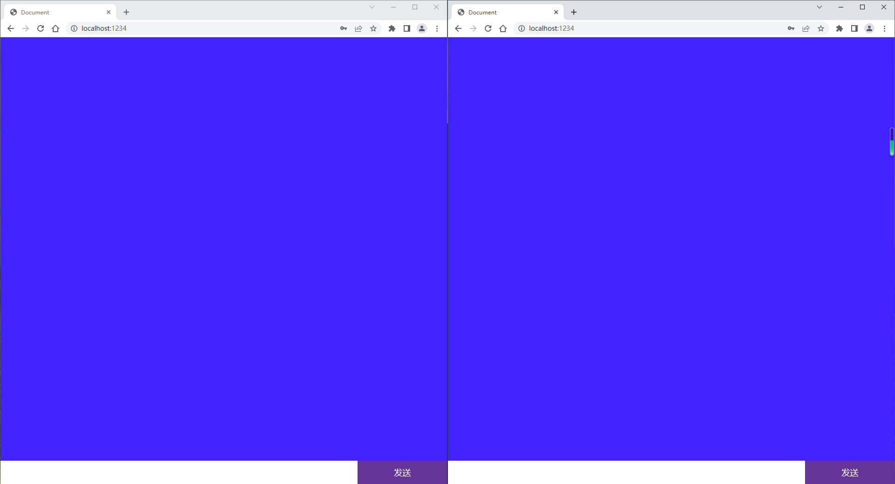
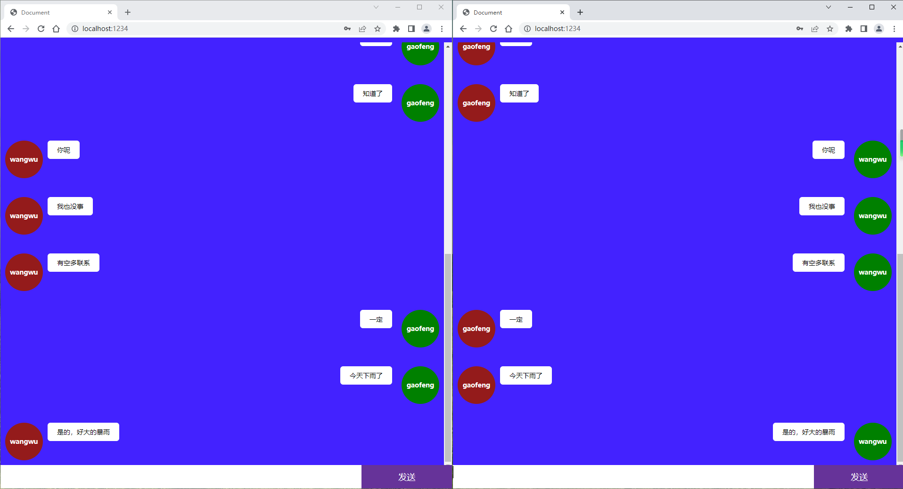

# socket.io 实战

因为没有线上数据库支撑，所以前端就不部署了，只能看看截图了

## 效果展示

<p align="center">
    
</p>

<p align="center">
    
</p>

<p align="center">
    
</p>
<p align="center">
    
</p>
<p align="center">
    
</p>
<p align="center">
    
</p>
<p align="center">
    
</p>

## 项目结构

```
parceldemo
├─ .proxyrc
├─ package copy.json
├─ package-lock.json
├─ package.json
├─ src
│  ├─ app.js
│  ├─ app2.js
│  ├─ chat.html
│  ├─ css
│  │  ├─ index.css
│  │  └─ reset.scss
│  ├─ imgs
│  │  ├─ a1.jpg
│  │  └─ a2.jpg
│  ├─ index.html
│  ├─ server copy.js
│  ├─ server.js
│  └─ utils
│     ├─ jquery.min.js
│     ├─ mysql.js
│     └─ socket.io.js
└─ yarn.lock

```

## 使用方式

- git clone

- yarn

- cd 项目

- yarn dev 启动前端

- nodemon ./server.js 启动本地数据客

## 注意

ws 链接的 ip 换成自己的 ip 就可以了
